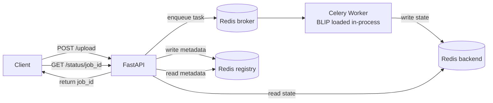

# Async Vision API

> Production-grade asynchronous inference service that turns any ML model into a scalable, fault-tolerant API. Built around BLIP image captioning as a reference implementation.


---

## Why this exists

Running ML inference inside a request/response cycle blocks the API and collapses under load. This project decouples **ingestion** from **inference**: the API accepts an image and returns immediately with a `job_id`, while a pool of Celery workers runs the model asynchronously. Clients poll for results.

The model is loaded **once per worker process** (not per task), so inference cost is amortized across requests instead of paid on every call.

---

## Architecture

**State ownership is explicit:**
- **Celery backend** is the single source of truth for task state (`PENDING`, `STARTED`, `RETRY`, `SUCCESS`, `FAILURE`).
- **Redis registry** holds only metadata (`submitted_at`, `filename`, `retries_left`).

---

## Features

- **Async non-blocking API** — upload returns instantly with a `job_id`.
- **In-process model loading** — BLIP is loaded once via `worker_process_init`, avoiding reloads on every task.
- **Automatic retries** — failed tasks retry up to 3 times with backoff (`self.retry`).
- **Job registry with TTL** — metadata auto-expires after 24h to prevent unbounded growth.
- **GPU-ready** — device is auto-selected (`cuda` if available, else `cpu`); no code change needed.
- **Strict input validation** — extension, size, and pixel limits enforced before enqueueing.
- **Config via Pydantic Settings** — no hardcoded URLs; env-driven for local vs Docker.
- **Health checks & ordered startup** — workers/API wait for Redis to be *ready*, not just started.

---

## Tech stack

| Layer        | Choice                                   |
|--------------|------------------------------------------|
| API          | FastAPI (async)                          |
| Task queue   | Celery (prefork)                         |
| Broker/Backend/Registry | Redis                         |
| Model        | `Salesforce/blip-image-captioning-base`  |
| ML runtime   | PyTorch + HuggingFace Transformers       |
| Packaging    | Docker + docker-compose                  |
| Config       | Pydantic Settings v2                      |

---

## Quick start

```bash
git clone https://github.com/<your-username>/async-vision-api.git
cd async-vision-api
```
# Create the Docker env file
```
cp .env.example .env.docker   # then edit if needed
docker compose up --build
```
API is available at `http://localhost:8000`.

---

## API

### `POST /upload`
Upload an image and enqueue inference.

```bash
curl -X POST http://localhost:8000/api/v1/upload \
  -F "file=@cat.jpg"
```
**Response**
```json
{
  "job_id": "3f2c8a1e-9d4b-4a7c-bb12-7e5f0a1d2c34",
  "status": "PENDING",
  "submitted_at": "2026-06-17T10:32:00+00:00"
}
```
### `GET /status/{job_id}`
Poll for the result.

```bash
curl http://localhost:8000/api/v1/status/3f2c8a1e-9d4b-4a7c-bb12-7e5f0a1d2c34
```
**Response (success)**
```json
{
  "job_id": "3f2c8a1e-9d4b-4a7c-bb12-7e5f0a1d2c34",
  "status": "SUCCESS",
  "result": {
"caption": "a cat sitting on a wooden table"
  }
}
```
**Response (pending)**
```json
{
  "job_id": "3f2c8a1e-9d4b-4a7c-bb12-7e5f0a1d2c34",
  "status": "STARTED",
  "result": null
}
```
---

## Project structure

```
app/
├── api/v1/
│   ├── health.py            # health endpoint
│   ├── main_router.py       # upload + status routes
│   └── read_write_file.py   # streamed file I/O
├── config/
│   ├── app_lifespan.py      # startup/shutdown hooks
│   └── settings.py          # Pydantic Settings (cached singleton)
├── services/
│   ├── model_loader.py      # BLIP load on worker_process_init
│   └── tasks.py             # Celery inference task
├── utils/
│   ├── file_helpers.py      # filename/path helpers
│   └── validation.py        # image validation
├── celery_app.py
└── main.py
docker-compose.yml
Dockerfile
```
---

## Design notes

- **Why path, not bytes, in the task?** Image paths serialize cleanly through Redis; passing raw bytes bloats the broker and breaks at scale. A shared `uploads/` volume makes the file reachable by any worker.
- **Why load the model in `worker_process_init`?** Loading inside the task would reload weights on every request. Loading at process init keeps the model resident in the worker's memory for its lifetime.
- **Celery as state source of truth.** Mixing app-level status with Celery's state causes drift; the backend owns task lifecycle, the registry owns metadata only.

---

## Roadmap

- [ ] Object storage (S3 / MinIO) instead of a shared volume for horizontal scaling.
- [ ] Batched inference for higher GPU throughput.
- [ ] Prometheus metrics + Grafana dashboard.
- [ ] Pluggable model interface to support arbitrary HF pipelines.
- [ ] CI (lint, type-check, tests) via GitHub Actions.

---

## License

MIT
